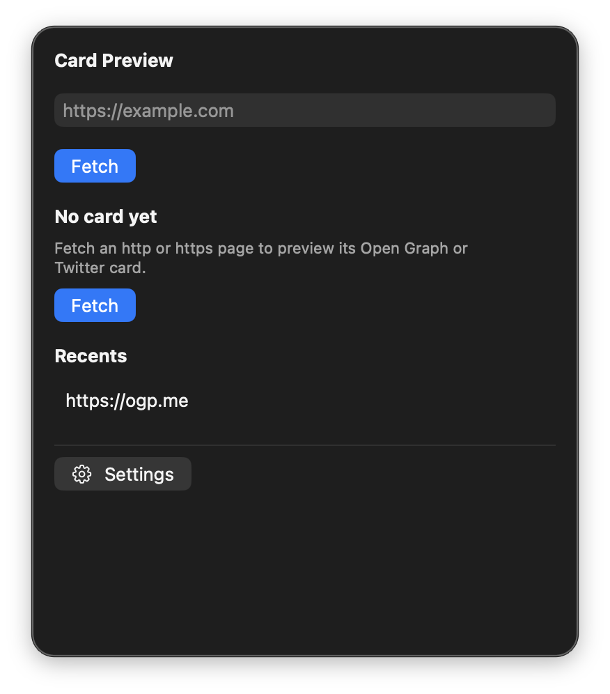

# Card Preview

[](https://github.com/BadryansahBangsawan/card-preview/actions/workflows/ci.yml)

Preview the Open Graph and Twitter card a URL would share — title, description, image, and canonical URL.

Menu extra for macOS 14+. It lives on the **right** of the menu bar and does not show a Dock icon.



| | |
|---|---|
| Product | `CardPreview` |
| Bundle ID | `engineer.badry.cardpreview` |
| Status item | SF Symbol `photo.on.rectangle` (title: first 24 graphemes of the page title, or `Card Preview`) |
| Panel | opaque ~360×420 pt |

## Features

- GET `http` and `https` only. HTML capped at 1 MB; image GET capped at 5 MB. HTTP to HTTPS redirects are followed; other schemes are rejected.
- Image scaled to a maximum height of 160 pt.
- **Copy title** and **Copy URL**. Recents cap at 20.

### Tag precedence

| Field | Order |
|---|---|
| Title | `og:title` → `twitter:title` → HTML `<title>` |
| Description | `og:description` → `twitter:description` |
| Image | `og:image` → `twitter:image` (resolved against the page URL) |
| URL | `og:url` → `rel=canonical` → the request URL |

Also shows `og:site_name`, `og:type`, and `twitter:card` when present.

If none of title, description, or image come from `og:` / `twitter:` tags, the panel shows **No Open Graph or Twitter card tags.** HTML `<title>` still appears if the page has one.

## Requirements

- macOS 14 Sonoma or later
- Swift 5.9 or later (Xcode or Command Line Tools) only if you build from source
- Network for Fetch

## Install

```bash
git clone https://github.com/BadryansahBangsawan/card-preview.git
cd card-preview
bash package-app.sh
ditto dist/CardPreview.app /Applications/CardPreview.app
xattr -cr /Applications/CardPreview.app
open /Applications/CardPreview.app
```

Ad-hoc signed (`codesign -s -`). If Gatekeeper blocks it or says it is damaged, run the `xattr` line. If it is still blocked: System Settings → Privacy & Security → Open Anyway.

Do not run `dist/CardPreview.app` while `/Applications/CardPreview.app` is running (same bundle ID).

Enable **Open at Login** from Settings if you want it after reboot.

## How to open

This is an `LSUIElement` extra. Proof it is running is the **photo.on.rectangle** status item on the **right** of the menu bar, not a window from Finder or Launchpad.

1. Click that extra. The panel is opaque (~360×420), not a 10px strip.
2. If the bar is full, look behind the Control Center overflow chevron **«**.
3. Double-clicking the app in Finder/Launchpad only changes the left-side app name. That is expected. There is no Dock icon.

## Usage

1. Click the extra.
2. Enter an `https://` URL and click **Fetch**.
3. Read title, description, image, and URL.
4. **Copy title** / **Copy URL**. Click a recent to prefill.
5. **Settings** at the bottom of the panel: Open at Login, Quit.

### Example

`https://ogp.me` → title **Open Graph protocol**, description, and `https://ogp.me/logo.png`.

`https://example.com` → **No Open Graph or Twitter card tags.** HTML title **Example Domain** still shows.

## Permissions

Network only. No Accessibility or Screen Recording.

## Data

| What | Where |
|---|---|
| Recents | `~/Library/Application Support/Card Preview/recents.json` |
| Open at Login | `SMAppService.mainApp` |

A missing recents file is an empty list. A file that will not decode is an empty list plus a red banner. The app does not crash.

## Privacy

Fetch uses an ephemeral `URLSession`. The URL you type leaves this Mac only as that HTTP request (HTML, then the image URL if one exists).

## Uninstall

Delete `/Applications/CardPreview.app`. Turn off Open at Login in Settings first if you enabled it.

```bash
rm -rf "$HOME/Library/Application Support/Card Preview"
```

## Troubleshooting

| What you see | What to do |
|---|---|
| Finder “opens” nothing / no Dock icon | Click the **photo.on.rectangle** extra on the right of the menu bar. |
| Extra missing | Overflow **«**, or `pgrep -x CardPreview` then `open /Applications/CardPreview.app`. |
| “Damaged” / cannot verify | `xattr -cr /Applications/CardPreview.app`. `spctl --assess` is `rejected` even when it runs. |
| **URL must be http or https.** | Use an `http` or `https` URL. |
| **No Open Graph or Twitter card tags.** | The page has no `og:` / `twitter:` title, description, or image. |
| **HTML truncated to 1MB.** | Only the first megabyte was parsed. |
| Image URL as text, no picture | Image download or decode failed; the red label has the error. |
| ~10px empty strip under the bar | Reinstall from this repo (panel min height 420). |

## Development

```bash
swift build
swift build -c release --product CardPreview
bash package-app.sh
```

Layout: `Sources/` (SwiftPM executable), `Info.plist`, `Assets/AppIcon.icns`, `package-app.sh`. Never commit `dist/`. `FunTheme.swift` is copied verbatim (no shared package).

## License

[MIT](LICENSE)
